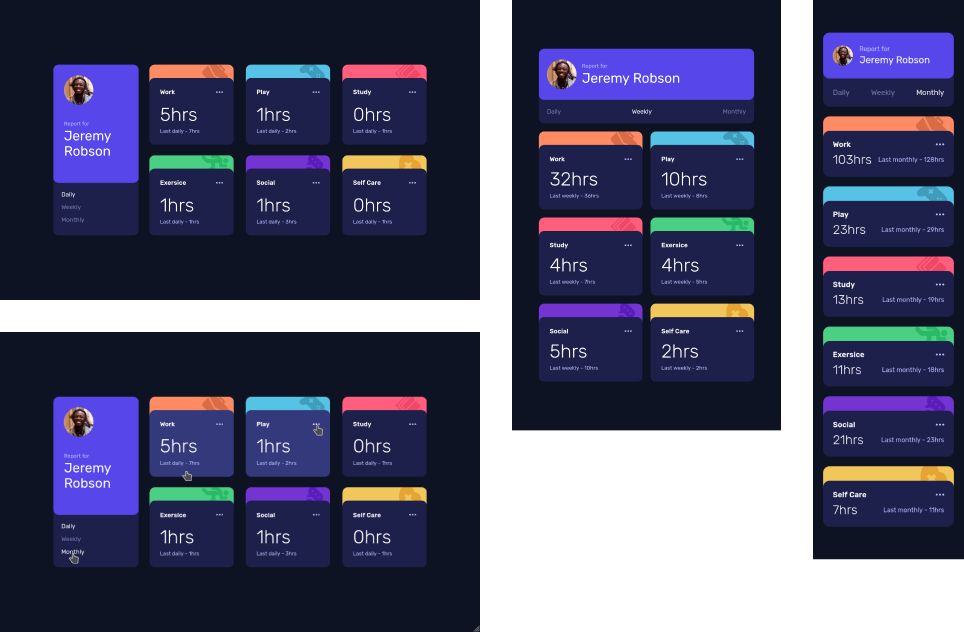

# Frontend Mentor - Time tracking dashboard solution

This is a solution to the [Time tracking dashboard challenge on Frontend Mentor](https://www.frontendmentor.io/challenges/time-tracking-dashboard-UIQ7167Jw). Frontend Mentor challenges help you improve your coding skills by building realistic projects. 

## Table of contents

- [Overview](#overview)
  - [The challenge](#the-challenge)
  - [Screenshot](#screenshot)
  - [Links](#links)
- [My process](#my-process)
  - [Built with](#built-with)
  - [What I learned](#what-i-learned)
  - [Continued development](#continued-development)
  - [Useful resources](#useful-resources)
- [Author](#author)

## Overview

### The challenge

Users should be able to:

- View the optimal layout for the site depending on their device's screen size
- See hover states for all interactive elements on the page
- Switch between viewing Daily, Weekly, and Monthly stats

### Screenshot

### Links

- [Solution URL](https://github.com/Alejandro25AR/Time-tracking-dashboard)
- [Live Site URL](https://alejandro25ar.github.io/Time-tracking-dashboard/)

## My process

### Built with

- Semantic HTML5
- SCSS with BEMIT
- Flexbox
- Mobile-first workflow
- JS Vanilla

### What I learned

- I reinforced the flexbox concepts and the work with the BEMIT convention.
- I learned about the guard clauses to decrease identation levels and improve code readability.

### Continued development

- The BEMIT convention is very useful because it allows us to write maintainable styles.
- The use of guard clauses to make the source code more readable and maintainable.

### Useful resources

- [❌ ERROR al MAQUETAR CSS: Te fijas en lo visual y no lo estructural ❌ Eduardo Fierro Pro](https://www.youtube.com/watch?v=-eMxRBq4iZs)

## Author

- Frontend Mentor - [@Alejandro25AR](https://www.frontendmentor.io/profile/Alejandro25AR)
